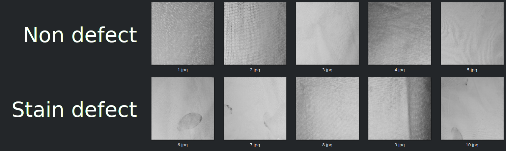

  

# Fabric stain defect classification in textile quality control

This dataset1 contains images of fabric stain defect classification in textile quality control.

The data can be used to build and train an ML model that can classify a picture of textile to detect if it has or not stain.

# Structure

This repo contains the following structure:

- **data**: contains the images directories.
- **dataset.csv**: CSV file with all required data.

  

The following shows a partial example of the data stored in **dataset.csv** that is used as the main example.

| **labels**  | **images**                    |
|-------------|-------------------------------|
| stain       | data/images/stain/1.jpg       |
| stain       | data/images/stain/2.jpg       |
| defect_free | data/images/defect_free/1.jpg |
| defect_free | data/images/defect_free/2.jpg |

The labels on CSV are:

- **stain**: stain image in textile picture
- **defect_free**: non stain in image

# Community

Got questions, feedback, or want to join a community of machine learning practitioners working with exciting tools and projects? Check out our [Community](https://forum.perceptilabs.com/)!

1 Dataset Credits: https://www.kaggle.com/priemshpathirana/fabric-stain-dataset

